# 🏡 Our Happy Home

[](https://github.com/SyubadubinStudios/OurHappyHome/actions/workflows/ci.yml)
[](https://github.com/SyubadubinStudios/OurHappyHome/releases/latest)

**⬇ Unduh / Download:** [Rilis terbaru (Windows · Linux · macOS)](https://github.com/SyubadubinStudios/OurHappyHome/releases/latest)

> *Setiap hari adalah cerita. Setiap keluarga adalah petualangan.*
> *Every day is a story. Every family is an adventure.*

**Dibuat oleh Ariana Mischa Fadhila dari Syubadubin Studios.**

Game simulasi kehidupan keluarga 3D yang dibuat dengan **.NET 10**, **Avalonia** dan **ThreeNet**.
Bangun dan hias rumah, jalani hari bersama Ayah, Ibu, Kak Nara, Raka dan Dinda, jelajahi kota, dan
pastikan **tidak ada yang tertinggal** saat keadaan darurat.

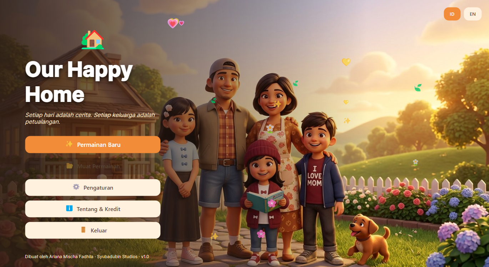

| Sarapan bersama | Rumah dari luar |
|---|---|
| 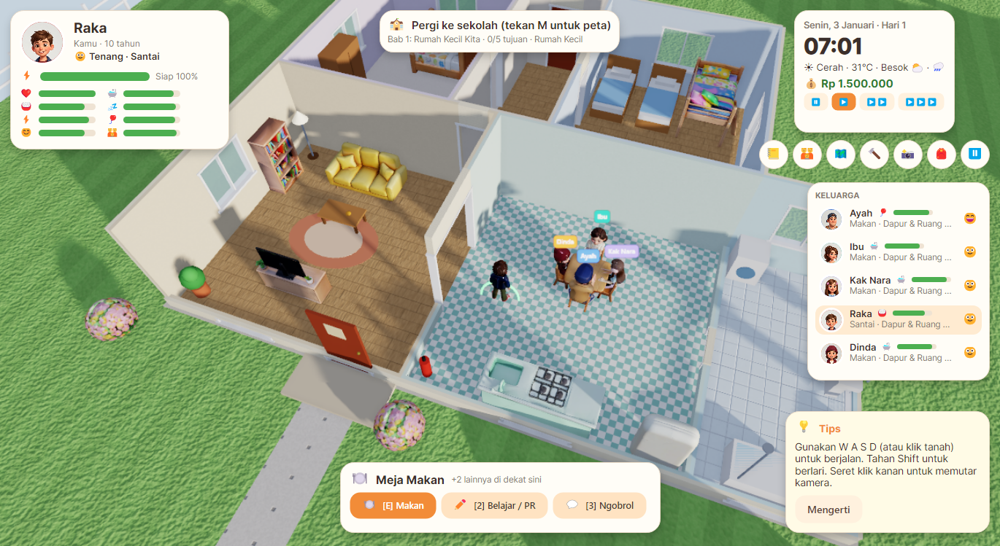 | 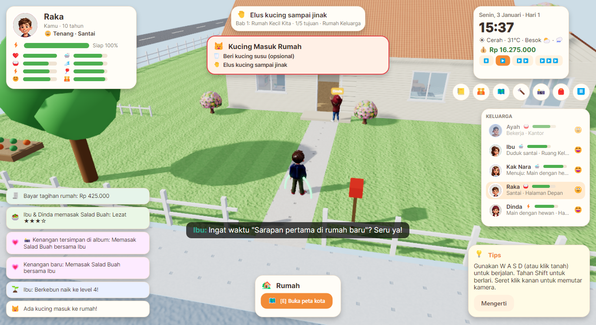 |
| **Listrik padam saat badai** | **Kebakaran kecil & penyelamatan** |
| 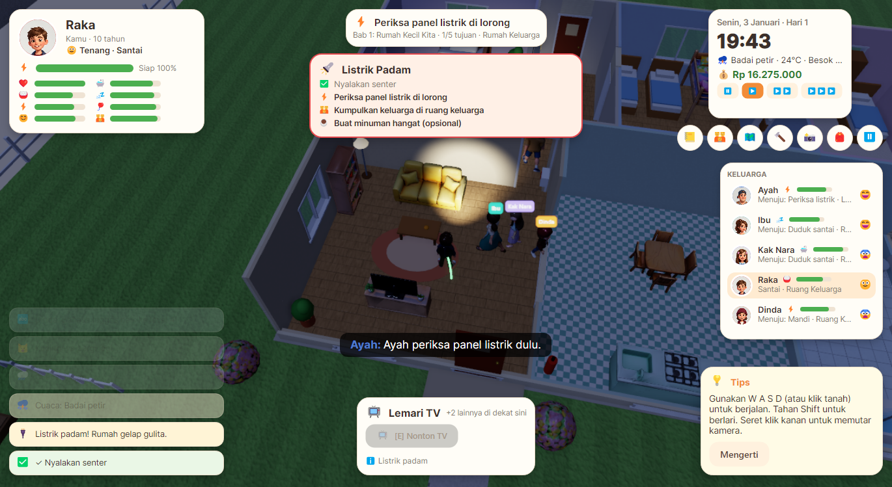 | 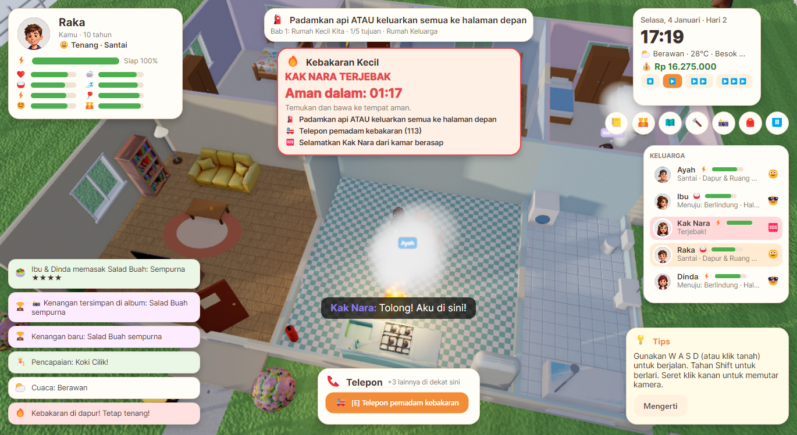 |
| **Mode bangun** | **Kemah keluarga** |
| 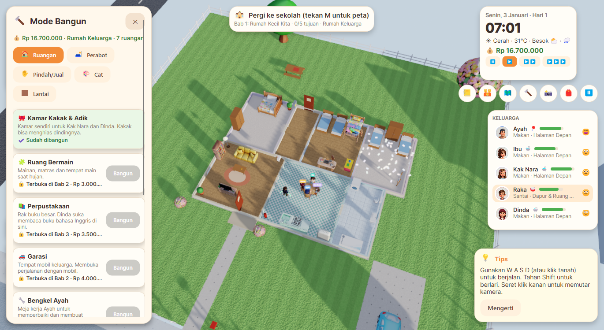 | 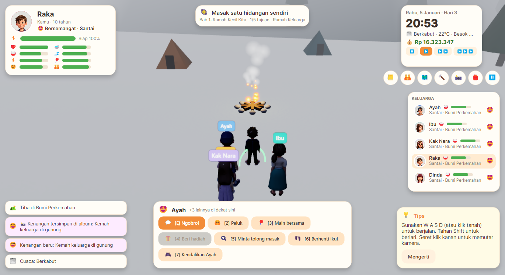 |
| **Mini-game memasak** | **Album kenangan keluarga** |
| 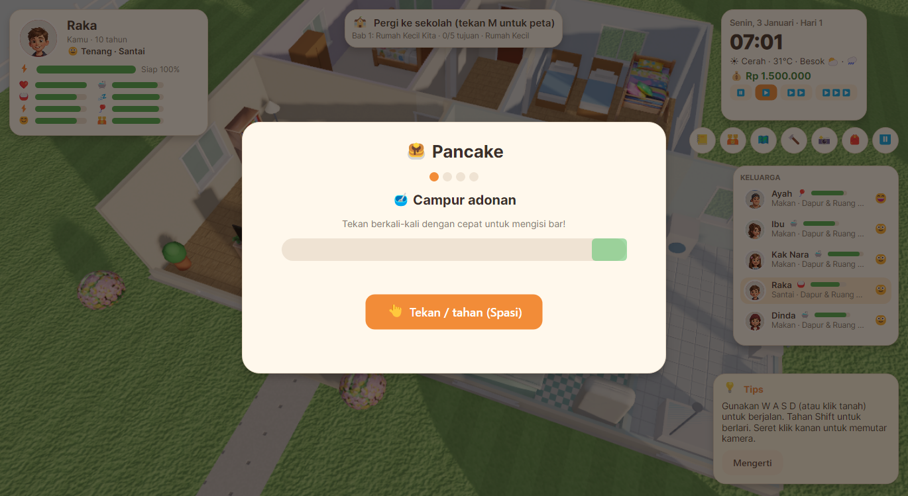 | 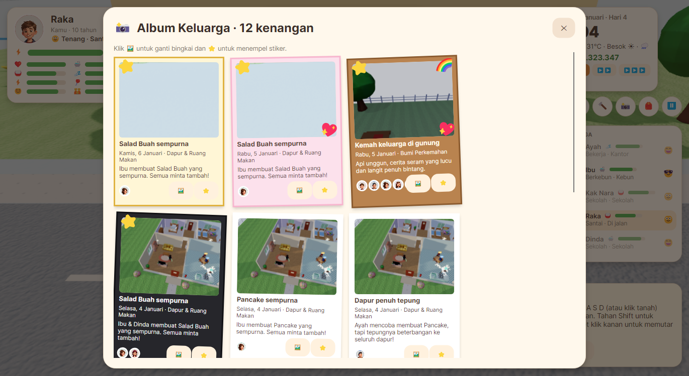 |
| **Baru v1.1: ruang kelas yang bisa dimasuki** | **Baru v1.1: kostum keluarga** |
| 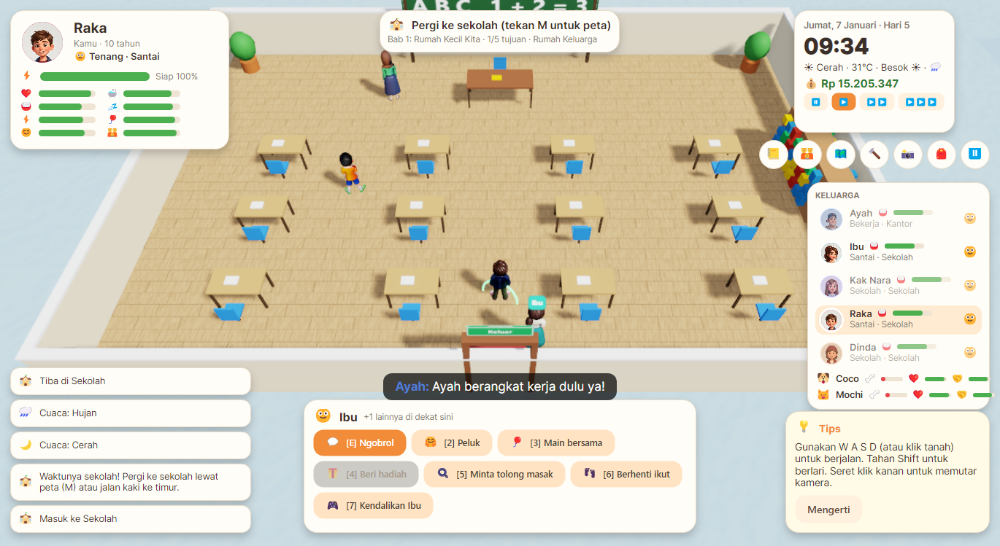 | 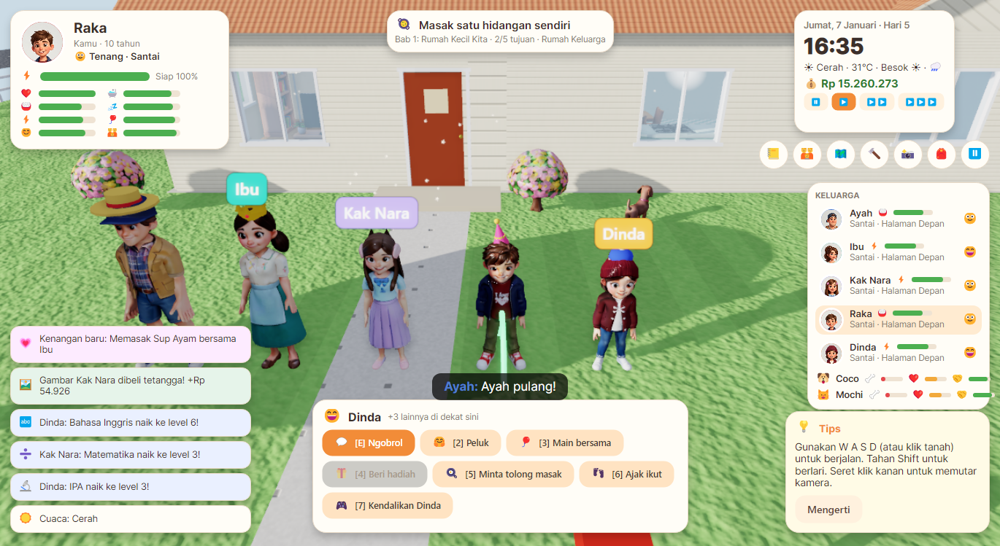 |
| **Baru v1.2: festival kota** | **Baru v1.2: tarik tambang** |
| 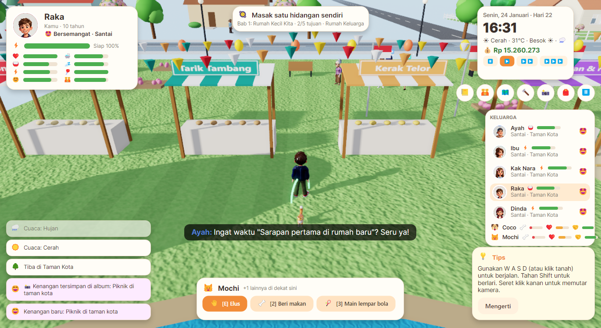 | 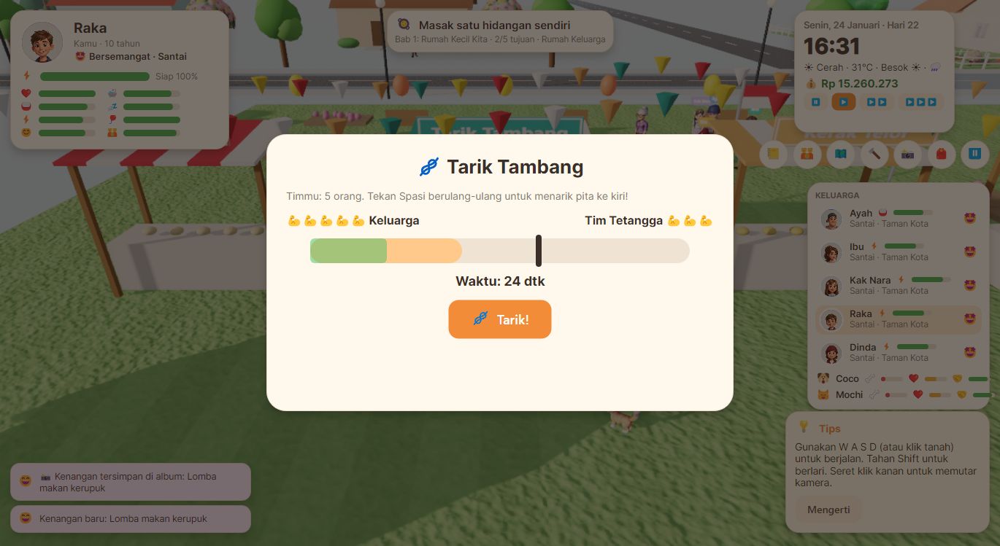 |

---

## Bahasa Indonesia

### Fitur utama

- **Lima anggota keluarga yang hidup sendiri.** Setiap karakter punya 8 kebutuhan, stamina, suasana hati,
  26 keahlian, kepribadian, ketakutan, cita-cita, kenangan dan hubungan dengan anggota lain. Mereka
  memasak, bekerja, sekolah, membaca, menggambar, mandi, tidur, mengobrol, bertengkar lalu berbaikan
  tanpa menunggu perintah pemain.
- **Bangun rumah** dari *Rumah Kecil* sampai *Rumah Impian*: 9 ruangan tambahan (kamar Kakak & Adik,
  ruang bermain, perpustakaan, garasi, bengkel, ruang rahasia, kebun, kolam renang, rumah pohon),
  40+ perabot interaktif, cat dinding dan lantai.
- **Kehidupan sehari-hari**: sarapan bersama, sekolah (6 pelajaran sebagai mini-game), gaji Ayah tiap
  Jumat, tagihan rumah, belanja, usaha kue Ibu, jualan limun anak-anak, hewan peliharaan, kalender
  dengan ulang tahun, malam nonton film, pagi pancake, festival dan kemah.
- **20 resep** (termasuk mi goreng, gado-gado, bubur ayam dan martabak manis) dengan 5 tingkat kualitas (Gagal → Sempurna) dan mini-game memasak. Masakan gagal bisa
  menghasilkan kejadian lucu, misalnya tepung beterbangan.
- **Cuaca dinamis**: cerah, berawan, hujan, badai petir, kabut, angin kencang dan badai besar, dengan
  siklus siang dan malam.
- **Kejadian acak dan darurat**: kucing masuk rumah, lampu pecah, keran bocor, monyet pencuri, listrik
  padam, banjir kecil, ular, babi hutan, orang mencurigakan, percobaan pencurian, kebakaran kecil dan
  **Badai Besar** selama beberapa hari.
- **Sistem penyelamatan**: anggota keluarga bisa *Butuh Bantuan*, *Terjebak* atau *Lemas*, lengkap dengan
  hitung mundur *"Aman dalam 00:42"*. Kalau gagal, muncul *KELUARGA GAGAL — Tidak ada yang boleh
  tertinggal* dan pemain bisa mengulangi kejadian.
- **Mode Santai dan Mode Petualangan** mengatur seberapa sering dan seberapa berat kejadian berbahaya.
- **Kota yang bisa dijelajahi**: rumah tetangga, taman, sekolah, supermarket, mal, klinik, restoran,
  arkade, taman bermain, pantai, hutan dan bumi perkemahan, plus peta kota dan perjalanan keluarga.
  **Ruang kelas, supermarket dan klinik bisa dimasuki** bersama keluarga.
- **Tetangga yang hidup**: Nenek Sari, Pak Budi, Dimas, Bu Guru Rina dan dr. Sinta, juga polisi, pemadam
  kebakaran, tim SAR, anjing, kucing, monyet dan ular, semuanya model Rodin yang dianimasikan lewat Blender.
- **Kenangan dan Album Keluarga** yang otomatis memotret momen penting, dengan bingkai dan stiker.
- **Kostum & topi** untuk seluruh keluarga: topi pesta, topi jerami, kupluk, mahkota dan telinga kucing.
  Keluarga juga memakai topi hujan sendiri saat hujan.
- **Musim hujan & kemarau, hari libur nasional, libur semester**, Hari Anak, Hari Ibu dan Hari Guru.
- **Festival kota** dengan lomba makan kerupuk, tarik tambang dan kembang api.
- **Tetangga dengan jadwal dan persahabatan**, termasuk teman sekelas yang datang mengajak main.
- **Naik mobil bersama Ayah atau angkot**, dan **liburan menginap** di tenda atau penginapan pantai.
- **Bahasa tubuh**: karakter melompat kecil saat senang, menunduk saat sedih, dan mulutnya bergerak saat bicara.
- **5 bab cerita** (Rumah Kecil Kita sampai Petualangan Besar), lalu mode bebas, ditambah 11 pencapaian.
- **Efek visual**: bayangan, bloom, SSAO, partikel (hujan, asap, api, uap, hati, konfeti, kembang api),
  kilat, dinding yang turun otomatis saat di dalam rumah, dan pintu yang membuka sendiri.
- **Suara dan musik**: 6 trek musik prosedural yang berganti mengikuti suasana, efek suara dan ambience
  sintetis, serta suara karakter dari ElevenLabs dengan suara *babble* sebagai cadangan.
- **Aksesibilitas**: ukuran teks, subtitle, bantuan membaca, bantuan warna (Deutan, Protan, Tritan,
  kontras tinggi), intensitas darurat dikurangi, kontrol sederhana (klik untuk berjalan), tutorial,
  tingkat kesulitan penyelamatan, dan jeda.
- Dua bahasa: **Bahasa Indonesia** dan **English**.
- Menu **Tentang** dengan kredit yang bergulir otomatis.

### Menjalankan

```bash
dotnet run --project src/OurHappyHome
```

Butuh .NET SDK 10 dan GPU dengan DirectX 12, Vulkan atau Metal. ThreeNet diambil dari NuGet
(`ThreeNet`, `ThreeNet.Avalonia` 0.7.0) lengkap dengan inti native-nya.

### Kontrol singkat

| Tombol | Fungsi |
|---|---|
| W A S D / panah, Shift | Berjalan, berlari |
| Klik kiri di tanah | Berjalan ke titik itu |
| Seret klik kanan, Z / C, roda mouse | Putar kamera, zoom |
| E / Enter, 1–9 | Interaksi |
| Tab | Ganti anggota keluarga yang dimainkan |
| J · K · M · B · L · I | Jurnal · Keluarga · Peta · Bangun · Album · Barang |
| F · P · Spasi · Esc | Senter · Foto · Jeda · Menu |

Installer untuk Windows, Linux dan macOS dibuat dengan `installer/build-all.ps1`. Lihat [docs/installer.md](docs/installer.md).
Roadmap ada di [Plan.md](Plan.md) dan progres di [Progress.md](Progress.md).

Dokumentasi lengkap ada di [docs/](docs/README.md).

---

## English

**Our Happy Home** is a 3D family life simulation built with **.NET 10**, **Avalonia** and **ThreeNet**.
Build and decorate the home, live each day with Dad, Mom, Nara, Raka and Dinda, explore the town, and
make sure **nobody gets left behind** when emergencies strike.

### Highlights

- **Five independently simulated family members** with needs, stamina, mood, skills, personality, fears,
  goals, memories and pairwise relationships. They run their own routines.
- **House building** from *Small Home* to *Dream Home*: 9 extra rooms, 40+ interactive furniture items,
  wall paint and floors.
- **Daily life**: shared meals, school lessons as mini-games, jobs and bills, shopping, a home bakery,
  a lemonade stand, pets, and a calendar of birthdays and family events.
- **Cooking**: 20 recipes, five quality tiers (Failed to Perfect) and a cooking mini-game.
- **Weather and day/night**, with **random events and emergencies** including the multi-day **Great Storm**.
- **Rescue system** with Needs Help, Trapped and Down states, rescue timers, and the *Nobody Gets Left
  Behind* restart.
- **Enterable classroom, supermarket and clinic**, animated **neighbours, visitors and pets**, and a
  **dress-up box** of hats and costumes.
- **Seasons, national holidays and school breaks**, a monthly **town festival** (cracker eating contest,
  tug of war, fireworks), **neighbour schedules and friendships**, **car and angkot travel**, **overnight
  trips**, and mood-driven **body language** with talking mouths.
- **Cozy and Adventure modes**, an explorable **town**, a **family album** of auto-captured photos with frames and stickers,
  **5 chapters** plus a sandbox, and **11 achievements**.
- **Effects, procedural music, sound effects and voices**, all of the **accessibility options** from the
  design document, and a bilingual UI.

```bash
dotnet run --project src/OurHappyHome          # play
dotnet test                                    # simulation tests
dotnet run --project src/OurHappyHome -- --screenshots docs/images   # regenerate screenshots
```

Platform packages: `installer/build-all.ps1` ([docs/installer.md](docs/installer.md)). Roadmap: [Plan.md](Plan.md) · checklist: [Progress.md](Progress.md).

See [docs/](docs/README.md) for the full documentation.

---

### Kredit / Credits

- **Dibuat oleh Ariana Mischa Fadhila dari Syubadubin Studios**
- Model 3D dan concept art: Rodin (Hyper3D), Nano Banana 2 dan Qwen Image lewat Rodin MCP
- Rigging dan animasi: Blender 5.2 lewat Blender MCP
- Suara karakter: ElevenLabs v3 lewat Rodin MCP
- Mesin 3D: [ThreeNet](https://github.com/DotNetVibeCoderz/Vibe_Graphics/tree/main/ThreeNet) (Gravicode Studios, dipimpin Kang Fadhil)
