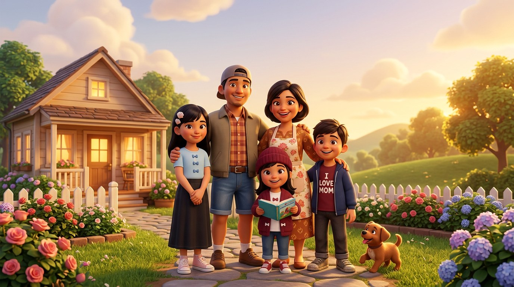
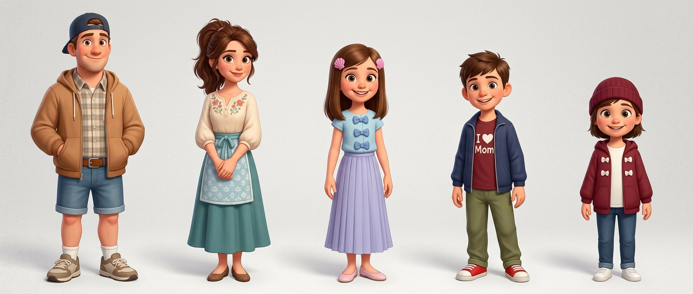
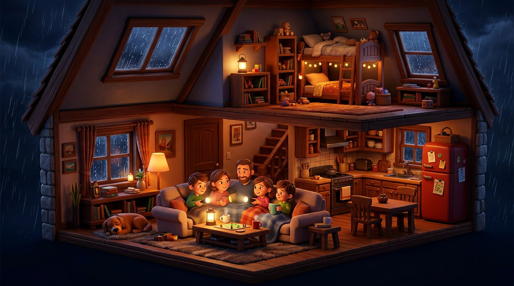
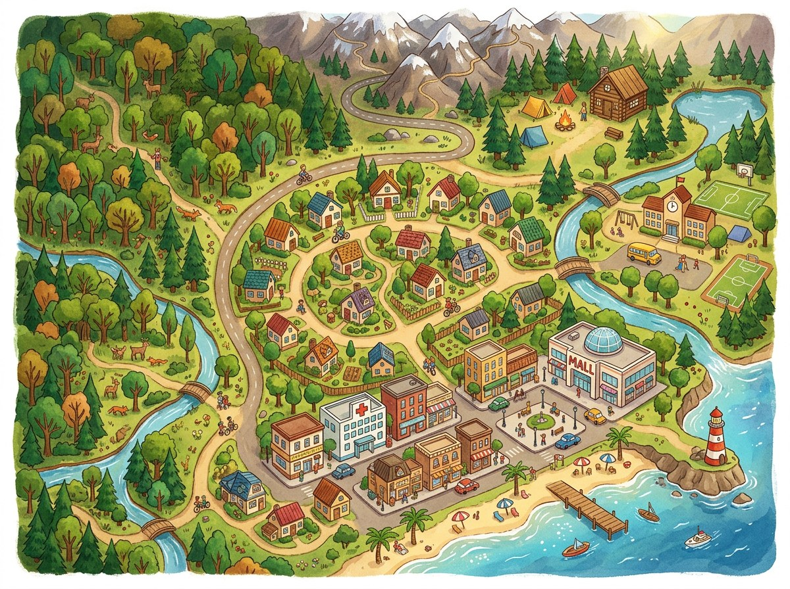
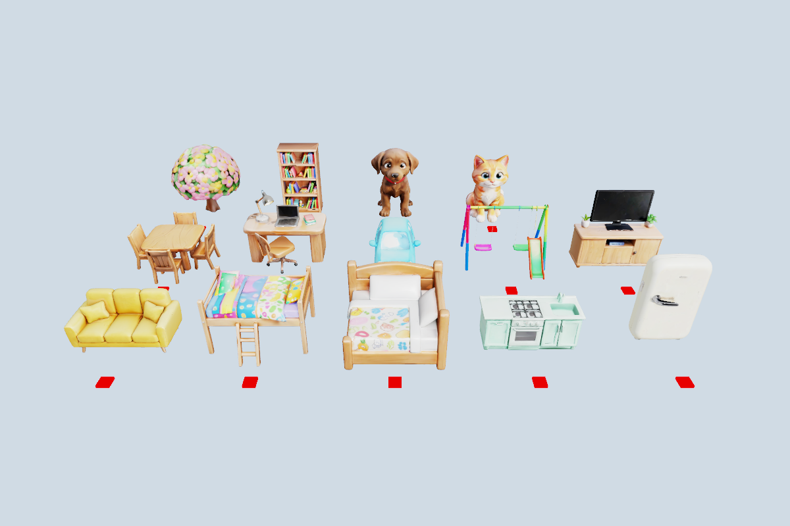
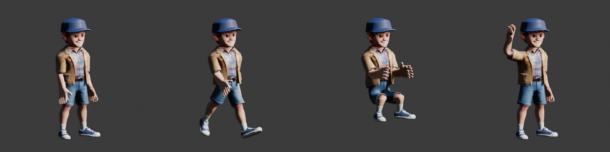
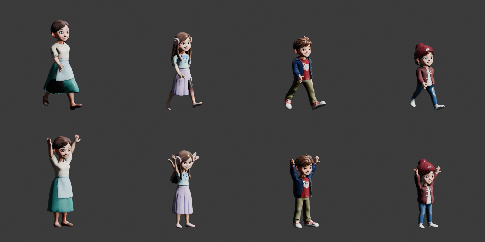
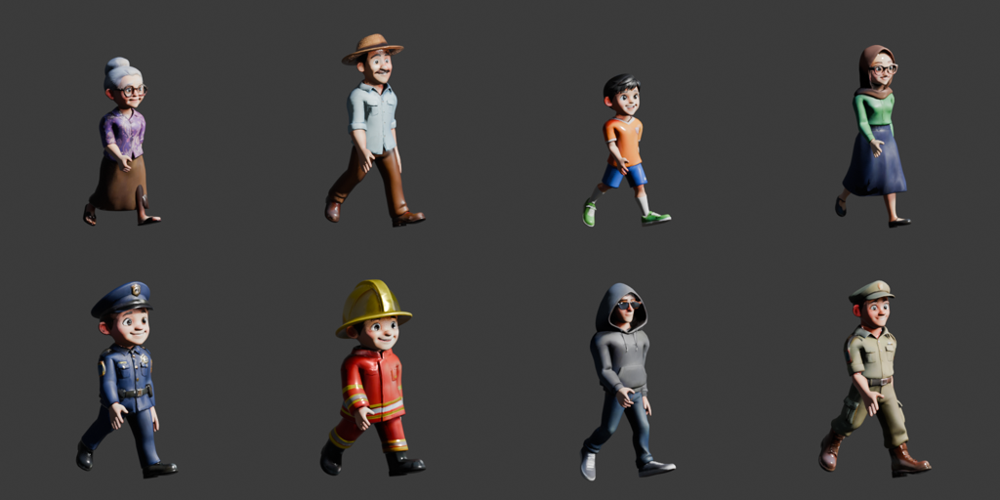
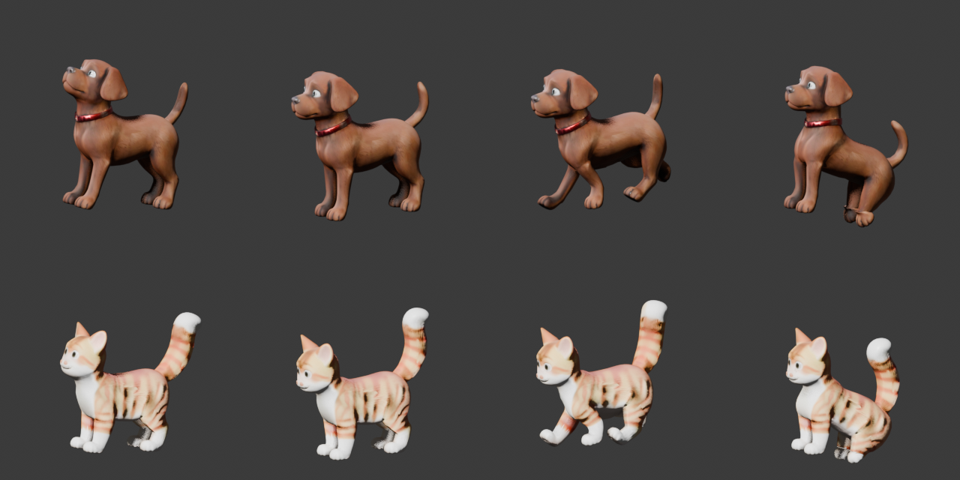

# Aset & pipeline

Semua aset dibuat khusus untuk game ini.

```
art/
├─ concept/   concept art (Rodin MCP: Nano Banana 2 / Qwen Image)
├─ raw/       model 3D mentah dari Rodin (Generate3DFromPrompt), T-pose untuk karakter
├─ rigged/    14 karakter ter-rig + 12 animasi, anjing & kucing ter-rig + 6 animasi (Blender MCP)
├─ props/     perabot, monyet, ular & pohon yang sudah dioptimasi (Blender)
└─ voice/     suara karakter (ElevenLabs v3 via Rodin MCP)
tools/blender/
├─ rig_character.py   rigging + skinning + animasi + ekspor GLB (manusia)
├─ rig_animal.py      rig berkaki empat (anjing, kucing) + 6 animasi
├─ optimize_prop.py   decimate + kompres tekstur + ekspor GLB
├─ preview.py / preview_anim.py / preview_poses.py   render pratinjau model & pose
```

## 1. Concept art (Rodin MCP)

| | |
|---|---|
|  |  |
| Key art (layar menu) | Lembar karakter (sumber potret HUD) |
|  |  |
| Interior rumah (layar loading) | Peta kota (panel peta) |

Potret bulat di HUD dipotong otomatis dari lembar karakter, dan ikon aplikasi dibuat dari key art.

## 2. Model 3D (Rodin MCP)

Karakter dibuat dengan `Generate3DFromPrompt` dalam **T-pose** (lengan lurus ke samping) supaya mudah
di-rig: Ayah, Ibu, Kak Nara, Raka dan Dinda, sesuai deskripsi pakaian di dokumen desain. Selain itu
ada 14 aset: sofa, ranjang loteng, ranjang ganda, konter dapur, kulkas, set meja makan, meja belajar,
mobil, ayunan, lemari TV, pohon bunga, rak buku, anjing dan kucing.



**v1.1** menambah 9 orang dalam T-pose (Nenek Sari, Pak Budi, Dimas, Bu Guru Rina, dr. Sinta, polisi,
pemadam kebakaran, tim SAR dan orang asing berkerudung), anjing dan kucing **berdiri** (agar bisa di-rig),
monyet yang memegang pisang, ular melingkar, dan pohon peneduh. Pohon dipakai bergantian dengan pohon
prosedural di kota dan halaman.

Semua prop menghadap +Z. `optimize_prop.py` menurunkannya ke ±6.000 face dan tekstur 1024 px JPEG,
sehingga ukurannya turun dari ±9 MB ke ±0,4 MB per model. Di game, `ModelLibrary` mengimpor setiap GLB
sekali lalu membuat salinan dengan `Node.Clone`, diskalakan agar pas dengan footprint perabot.

## 3. Rigging & animasi (Blender MCP)

`tools/blender/rig_character.py` dijalankan lewat `execute_blender_code` Blender MCP di Blender 5.2:

```python
exec(open(r".../tools/blender/rig_character.py").read(), ns)
ns["process"](r"art/raw/father.glb", r"art/rigged/father.glb", 1.74)
```

Skrip ini:

1. Menggabungkan dan membersihkan mesh, lalu men-decimate ke 14.000 face dan memperkecil tekstur.
2. Menaruh model di lantai dengan tinggi sesuai usia (1,74 / 1,64 / 1,42 / 1,36 / 1,22 m).
3. Mencari sendi dari bentuk mesh: garis lengan, leher tersempit, selangkangan (dengan cadangan
   proporsi untuk rok) dan posisi kaki.
4. Membuat armature humanoid dengan 19 tulang dan *skinning* bone-heat, plus bobot berbasis jarak
   untuk verteks yang terlewat (maksimal 4 pengaruh).
5. Membuat **14 aksi**: Idle, Walk, Run, Wave, Sit, Sleep, Cook, Cheer, Scared, Talk, Work, Read,
   Happy, Sad. Rotasinya ditulis dalam ruang armature sehingga tidak bergantung pada *roll* tulang.
6. Menambah tulang **Jaw** (v1.2): engsel setinggi hidung, bobot ke wajah bagian bawah dengan peralihan
   halus. Jaw tidak pernah diberi keyframe, dan `strip_channels` membuang kanal hasil *sampling*
   eksporter dari GLB, sehingga game bebas membuka dan menutup mulut saat karakter bicara.
7. Mengekspor GLB (skin + semua aksi) yang dibaca ThreeNet sebagai klip animasi.




Di game, `CharacterView` memutar klip dengan *cross-fade* bobot, menyesuaikan tinggi pinggul saat
duduk, dan memutar badan saat berbaring di ranjang. Saat ada balon bicara dan anggota sedang berdiri,
klip **Talk** diputar.

Skrip yang sama me-rig tetangga dan petugas v1.1 (tinggi 1,36–1,75 m). Di game mereka dimuat
per instance oleh `AnimatedFigure` dengan klip Walk/Idle/Talk/Run:



### Hewan berkaki empat

`tools/blender/rig_animal.py` memakai fungsi bantu `rig_character.py` dan:

1. Mencari telapak kaki (empat kelompok verteks terbawah), punggung dan perut di antara kaki, kepala
   (ujung depan di atas bahu) dan ekor (verteks paling belakang di atas pantat).
2. Membuat tulang Body, Neck, Head, Tail1/Tail2 dan dua tulang per kaki.
3. Membuat **Idle** (bernapas, ekor bergoyang), **Walk/Run** (kaki diagonal berpasangan), **Sit**,
   **Sleep** (berbaring, kaki dilipat) dan **Bark**.

```python
ns = {"__file__": r".../tools/blender/rig_animal.py"}
exec(open(ns["__file__"]).read(), ns)
ns["process"](r"art/raw/dog-standing.glb", r"art/rigged/dog.glb", 0.62)
```



### Model buatan Blender (v1.3)

Saat kredit Rodin habis, `tools/blender/model_props.py` membangun model langsung di Blender lewat Blender MCP
dari bentuk dasar dengan warna PBR polos: perahu jukung, menara penjaga pantai, kursi & payung pantai, tenda
kubah, bangku kayu, batu, tiang bendera, dan enam pengunjung (turis, Pramuka, pendaki) dalam T-pose yang lalu
di-rig dengan `rig_character.py`.

```python
ns = {"__file__": r".../tools/blender/model_props.py"}
exec(open(ns["__file__"]).read(), ns)
ns["build_all"](r".../art/blender")
```

`preview_poses.py` merender beberapa aksi sekaligus untuk pemeriksaan cepat:
`blender -b --python tools/blender/preview_poses.py -- art/rigged/dog.glb out/d 1.0 Idle:1 Walk:7 Sit:1`.

## 4. Suara karakter

Kalimat penting direkam dengan `GenerateVoiceWithElevenLabsV3` (Bahasa Indonesia). Ada 45 file di
`src/OurHappyHome/Assets/Voice/`: kalimat keluarga (`dad_*`, `mom_*`, `os_*`, `boy_*`, `ys_*`, misalnya
`ys_scared`, `os_cat`, `mom_dinner`, `boy_found`) dan tiga kalimat untuk setiap tetangga
(`npc_grandma_0..2`, `npc_budi_*`, `npc_dimas_*`, `npc_teacher_*`, `npc_doctor_*`). Teks subtitle di
kode sama persis dengan isi rekaman. Kalimat tanpa rekaman memakai **suara babble sintetis** dengan nada
khas tiap karakter, dan suara anak dinaikkan nadanya sedikit. Subtitle selalu tersedia.

## 5. Musik & efek suara (prosedural)

Tidak ada file musik. `Audio/MusicComposer.cs` menggubah 6 loop saat game mulai:

| Mood | Tempo / kunci | Instrumen |
|---|---|---|
| Santai | 92 BPM, C mayor | piano arpeggio, bass, shaker |
| Jelajah | 112 BPM, G mayor | ukulele (Karplus-Strong), lonceng FM, drum pop |
| Perayaan | 124 BPM, F mayor | lead, stab, tepuk tangan |
| Haru | 72 BPM, A minor | pad, piano |
| Tegang | 104 BPM, D minor | ostinato petik, pad gelap, tik-tik |
| Malam | 76 BPM, Eb mayor | kotak musik, pad |

`Audio/SoundBank.cs` membuat sekitar 50 efek suara (klik, langkah, petir, gonggongan, meong, sirene,
alarm, alat pemadam, kaca pecah, koin, fanfare, dan lainnya) serta 7 loop ambience.
